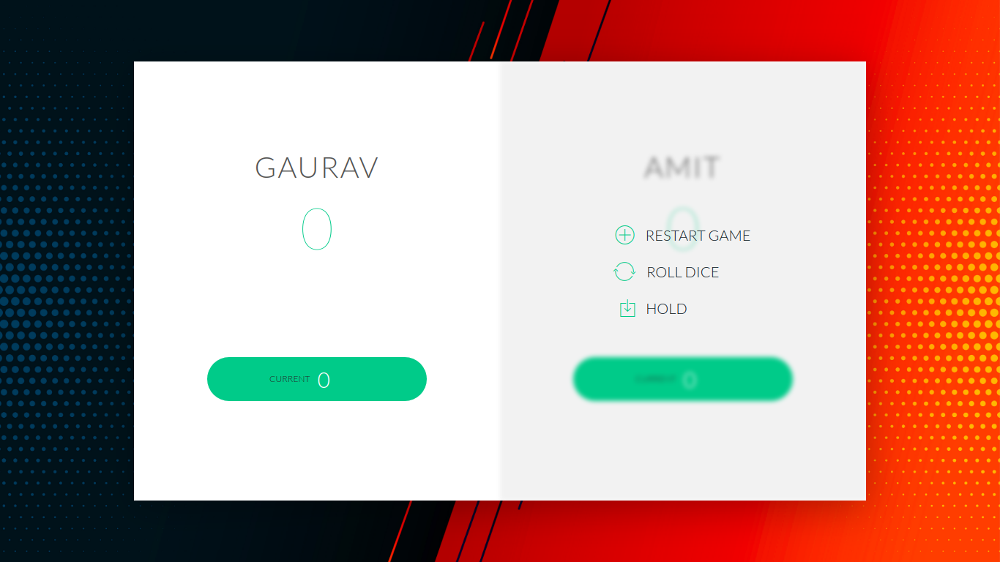
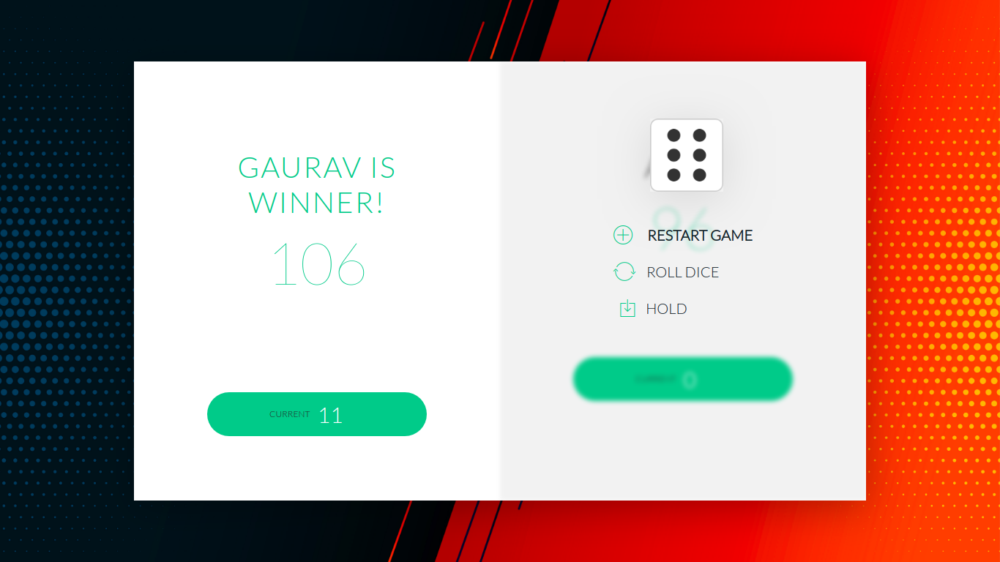

## DICE-GAME
> Ubuntu 18.04.4 LTS.

### Rules 
> Game Rules
* The game has 2 players, playing in rounds
* In each turn, a player rolls a dice as many times as he whishes. Each result get added to his ``CURRENT ROUND SCORE``
* but, if the current player rolls a ``1``, all his ``CURRENT ROUND SCORE`` gets lost
* Ans after that, it's the next player's turn
* The player can choose to ``HOLD``, which means that his ``CURRENT ROUND SCORE`` gets added to his GLBAL score
* And after that, it's the next player's turn again
* The player who reach ``100`` points first on ``GLOBAL SCORE`` wins the game
* You can add player's name just by clicking on player name shown in UI

> working of game

